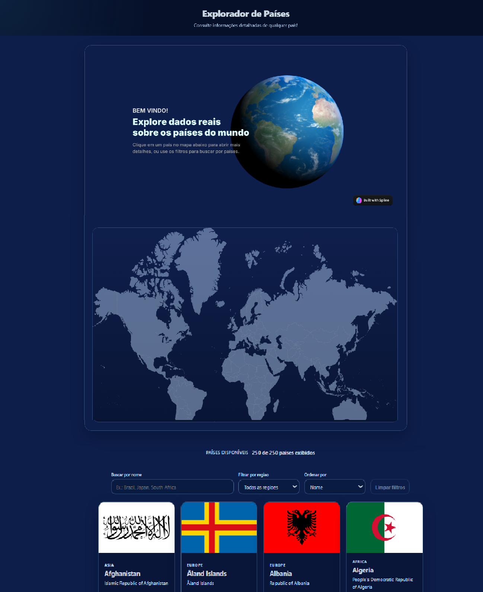

# 🌍 Country Explorer



Uma aplicação Angular para explorar países do mundo utilizando dados reais da API pública **REST Countries**.

Você pode:

* 🔎 Buscar países por nome
* 🌎 Filtrar por região
* 📊 Ordenar resultados
* 🗺️ Explorar detalhes de cada país
* 🌐 Interagir com um mapa/globo visual na página inicial

---

## 🚀 Como rodar o projeto localmente

### Pré-requisitos

* Node.js 20+ (recomendado LTS)
* npm

### Instalação

1. Instale as dependências:

```bash
npm install
```

2. Rode o ambiente de desenvolvimento:

```bash
npm start
```

3. Acesse no navegador:

http://localhost:4200

---

## 📜 Scripts úteis

* `npm start`: sobe o servidor de desenvolvimento (`ng serve`)
* `npm run build`: gera build de produção
* `npm test`: roda testes

---

## 🧠 Decisões técnicas

**Angular + Signals**

* Utilizei Signals para gerenciar estado local da página (busca, filtros e ordenação).
* Isso torna o fluxo mais previsível e reduz a necessidade de múltiplos subscriptions.

**Integração com RxJS**

* A API é consumida com HttpClient e integrada ao estado da aplicação usando `toSignal`.

**Cache de dados**

* A lista de países é armazenada em memória usando `shareReplay(1)` para evitar múltiplas chamadas à API.

**Camada de mapeamento**

* Os dados da API são convertidos para modelos internos (`CountrySummary` e `CountryDetail`) para desacoplar o domínio da aplicação da estrutura da API.

---

## 🔧 O que eu faria com mais tempo

* Criar testes automatizados mais completos
* Melhorar acessibilidade (ARIA, navegação por teclado)
* Consolidar tokens de design (cores, tipografia, espaçamentos)
* Adicionar monitoramento de erros de API
* Otimizar o custo de renderização do globo 3D em dispositivos mais fracos
